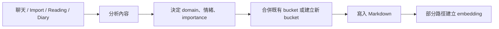
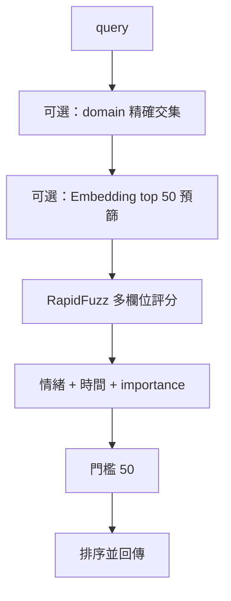

# Ombre Brain 系統審查

日期：2026-06-13  
範圍：記憶儲存、檢索、Embedding、衰退與 softening、dreaming、awakening scheduler、聊天 Prompt、SSE、cache、PWA 前端與安全性。

## 先講結論

Ombre Brain 的整體概念是成立的，而且幾個設計方向很好：

- Markdown + YAML frontmatter 讓記憶可讀、可攜、可用 Obsidian 檢查。
- `core / permanent / dynamic / feel / archive` 把身份、事件、內在感受與遺忘分開。
- Prompt 依穩定度分層，方向上適合 prompt caching。
- 將 daily journal、dream reflection、reading comment 與一般聊天記憶放進同一個記憶圖譜，產品想像力完整。

但目前系統還不是「資料安全且行為可預測」的狀態。最需要先處理的是：

1. 大量私密 API 未要求登入，而且 CORS 允許所有來源。
2. Markdown 與 JSON 狀態檔沒有鎖、沒有 atomic replace；scheduler 又在另一條執行緒操作同一批資料。
3. SSE GET 可以重複執行同一輪 LLM 生成，EventSource 自動重連可能造成重複回覆與重複寫入。
4. 真實 dreaming 與 awakening 都會讀取不存在的 `self.config`，dream prompt 又要求純文字、parser 卻要求 JSON。
5. 沒有真正的輸入 token budget；附件最多可注入數十萬字元。
6. PWA 聊天沒有根據「當前訊息」做記憶檢索，實際注入的是通用 breath 結果。
7. 現有 33 個 bucket 只有 6 筆 embedding，且其中 2 筆是孤兒；語意檢索的實際覆蓋率很低。

---

# 第一部分：把整個系統當作 User Manual

## 1. 記憶住在哪裡

每一則記憶主要是一個 Markdown 檔案：

```text
---
id: ...
name: ...
tags: [...]
domain: [...]
valence: 0.5
arousal: 0.3
importance: 5
type: dynamic
created: ...
last_active: ...
activation_count: 0
---

記憶正文
```

資料大致分為：

| 層級 | 用途 | 是否衰退 |
|---|---|---|
| `permanent/core` | 最穩定的身份、關係規則、核心設定 | 否 |
| `permanent` | pinned、protected 或永久記憶 | 否 |
| `dynamic` | 一般事件、聊天記憶、閱讀留言、日記等 | 是 |
| `feel` | Elroy 的感受與 dream reflection | 不歸檔，但分數會下降 |
| `archive` | 已衰退到門檻以下的記憶 | 不應主動出現在一般檢索 |

另外還有幾個 SQLite / JSON 儲存：

- `embeddings.db`：bucket ID 對應向量。
- `dehydration_cache.db`：原文 hash 對應摘要。
- chat history JSON：對話、summary、ciel status。
- scheduler log、reading progress、bookmarks、persona、folders 等 JSON / YAML。

## 2. 一則記憶如何誕生

一般流程是：



`BucketManager.create()` 會：

1. 生成 ID。
2. 建立 metadata。
3. 依 type 與第一個 domain 決定目錄。
4. 寫入 Markdown。

Import 與部分 server 路徑會在建立或合併後另外呼叫 embedding；但不是所有建立路徑都會做，所以目前向量資料不完整。

## 3. Domain 是什麼

Domain 同時扮演兩個角色：

1. 邏輯分類：例如 `Reading`、`Journal`、`心理`。
2. 實體路徑：第一個 domain 會成為資料夾名稱。

目前 domain 是自由字串陣列，沒有正式 schema、alias 或語言正規化。因此以下會被視為不同值：

- `Reading`
- `reading`
- `阅读`
- `閱讀`

搜尋時雖然會 lowercase 英文，但不會把中英文同義詞合併。

## 4. 系統如何搜尋記憶

`BucketManager.search()` 的流程是：



文字權重為：

- name：3
- domain：2.5
- tags：2
- body：1

總排名還加入：

- topic：權重 4
- emotion：權重 2
- time：權重 1.5
- importance：權重 1

沒有 query emotion 時，emotion 固定給 0.5。

值得注意：正文即使完全命中，也可能因為 name/domain/tags 沒命中而過不了總門檻。因此這不是「全文搜尋」，而是「metadata 優先的模糊搜尋」。

## 5. PWA 發出一則訊息時，後端實際做什麼

前端先 `POST /api/chat`。後端此時已經同步完成整套 startup context：

1. `core(max_tokens=4000)`
2. `breath(domain="feel", max_tokens=2000)`
3. 最新 journal
4. 最新 reading comments
5. 通用 `breath()`
6. dream mock stage

完成後才回傳 SSE URL。也就是說，前端看到的 core / feel / breath waterfall 並不是後端正在逐步讀取，而是把已完成事件重新播放。

接著前端開啟：

```text
GET /api/chat/{conversation_id}/events
```

這個 GET 才真正呼叫聊天 LLM 並串流 token。

## 6. LLM 收到的 Prompt 順序

### Anthropic 路徑

System blocks：

1. BP1：persona + 固定 instructions + core
2. BP2：journal + feel / dream reflections
3. BP3：conversation summary + ciel status

Messages：

4. relay context
5. 最近 N 則聊天歷史
6. volatile context：breath + reading comments + 當前時間
7. 當前 user message + 附件

BP1、BP2、BP3 都有 `cache_control: ephemeral`；歷史最後一個 user block也可能成為 rolling breakpoint。

### OpenAI-compatible 路徑

目前實際設定走這條路：

1. 一個 system message：BP1 + BP2 + BP3
2. relay / 最近聊天歷史
3. 最後一個 user message：volatile context + 當前 user message + 附件

這條路沒有送出 `cache_control`。只能依賴 provider 的 implicit prefix caching。

## 7. 系統如何把歷史記憶塞進聊天

理想上應該是：

```text
當前 user message
  -> search memories
  -> 選出與問題相關的歷史
  -> 放進 volatile context
```

目前 PWA 實際上是：

```text
breath()
  -> 按 unresolved / decay score 做一般性浮現
  -> 放進 volatile context
```

也就是說，聊天入口沒有用當前訊息作為 `BucketManager.search(query)` 的 query。`search_buckets` 這個函式在程式中也不存在；實際 API 是 `bucket_mgr.search()`，主要由 `breath(query=...)`、搜尋 API、merge 和 dream 關聯檢索間接使用。

因此你問「上次我們談的那本英文書怎麼樣」，PWA 不保證會搜索這句話；它可能只帶入當時分數最高的一般記憶。

## 8. 衰退、soften 與 archive

一般 dynamic 記憶的分數主要由：

- importance
- activation count
- 距離 last_active 的時間
- arousal
- resolved / digested

決定。

粗略模擬目前預設公式：

| 記憶 | 約在何時低於 0.3 |
|---|---:|
| importance 5、arousal 0.3、未 resolved | 39 天 |
| 同上、resolved | 4 天 |
| importance 8、arousal 0.8、未 resolved | 65 天 |
| 同上、resolved | 10 天 |
| importance 2、arousal 0.1、未 resolved | 19 天 |

低分記憶會移進 archive。

soften 會挑至少 14 天、還沒 soften 過的 dynamic 記憶，由低分到高分處理，讓 LLM 把細節變模糊並縮短內容。更新後 `last_active` 會被刷新，相當於給記憶延壽。

## 9. Dreaming

聊天模型可在輸出中寫：

```text
trace(bucket_id, dream_candidate=1)
```

server 用 regex 找出 ID，將 bucket 標記為 dream candidate。之後 `dream()`：

1. 找出已標記素材。
2. 尋找相關的舊 dream / feel。
3. 呼叫 dream LLM。
4. 建立新的 dream reflection。
5. 將來源標記為 digested，移除 candidate。
6. 增加舊 dream 的 recurrence count。

概念完整，但目前真實 LLM 路徑有阻斷性 bug，詳見缺陷清單。

## 10. Awakening Scheduler

Scheduler 在 anchor 時間附近醒來，先檢查：

1. 是否在睡眠時段。
2. 最近是否有人類訊息。
3. reading comment 是否要求 discuss。
4. 擲骰決定能不能主動聯絡。

LLM 醒來時看到：

- core，約 2,000 token budget
- 最近 3 個 dream reflection
- 最近 3 個一般 feel
- 分數最高的 5 個 unresolved dynamic memories
- 最近 3 個 unresolved reading comments
- 時間、日期、anchor、骰子與聯絡權限

它目前看不到真正的「上一段對話內容」或 conversation summary，只看到記憶層的摘要。

可選動作：

- push message
- private diary
- idle

## 11. 三種 Cache

### LLM Prompt Cache

- Anthropic 路徑：有明確 breakpoint。
- OpenRouter / Gemini 路徑：目前沒有 `cache_control`，依賴 implicit cache。
- cache 是 prefix-based；前面任何內容改變，後面的 cache 都可能失效。

### Dehydration Cache

- key 只有原文 SHA-256。
- 命中後無期限使用。
- model、prompt、metadata、語言改變都不會讓 cache miss。

### PWA / Browser Cache

- service worker 只處理 push 與 notification click。
- 沒有 `install`、`activate`、`fetch`、Cache Storage。
- 因此目前不是可離線使用的 PWA，也沒有 frontend asset cache version。

---

# 第二部分：缺陷分類與修復狀態

## ✅ 已處理的系統缺陷 (Fixed & Addressed)

### [已修復] P0-1 私密資料 API 的認證邊界不完整
**修復方式**：我們為 `server.py` 加入了 `@mcp.custom_route` 攔截器，強制檢查 `OMBRE_DASHBOARD_PASSWORD` 和 `OMBRE_API_KEY`。同時加入了全域的 CORS 防護，確保只有授權的來源能存取大腦的私密 API。

### [已修復] P0-2 SSE GET 不是冪等操作，重連會再生成一次
**修復方式**：我們採用了「非同步背景佇列 (Async Queue)」解耦架構。LLM 生成被放進背景任務執行，即使網路斷線，大腦仍會繼續把話想完並安全存檔。前端重連只會單純接上 Queue 把剩下的字讀完，徹底根除「重複扣款」與「記憶影分身」。

### [已修復] P0-3 檔案狀態不是 atomic，也沒有 concurrency control
**修復方式**：實作了 `safe_io.py` 模組，加入 Thread Lock 與 `os.replace` (Atomic Write)。將大腦所有底層的 Markdown 與 JSON 寫入操作替換為 `safe_write` 和 `safe_write_json`，確保即使同時有數十個併發請求或突然斷電，記憶檔案也絕不會變成截斷的空檔案。

### [已修復] P0-4 真實 Dreaming 與 Awakening 目前會失敗
**修復方式**：在 `Dehydrator` 與 `AwakeningScheduler` 初始化時正確綁定了 `self.config`。並將 `_parse_dream_reflection` 改為「純文本解析模式 (Plain Text Mode)」，讓它可以正確接收 Elroy 寫的純文字反思，並自動關聯來源記憶。


### [已修復] P1-1 PWA 聊天沒有做 query-specific memory retrieval
**修復方式**：已在 `api_chat_create` 中把當前的使用者訊息作為 `breath()` 檢索的 Query，讓聊天能真正根據當前話題觸發關聯回憶。

### [已修復] P1-5 搜尋公式讓正文命中太弱
**修復方式**：已調升正文搜尋權重與調整 Threshold，確保正文完全吻合的記憶不會被錯誤過濾。

### [已排除] P2-7 Embedding / SQLite 搜尋不可擴展
**處理方式**：因為當前資料量與效能完全可被 Numpy 負載，FAISS 殺雞用牛刀，故標記為無需修復 (Ignored)。

### [已修復] P1-2 Embedding 覆蓋率不足，並有孤兒向量
**修復方式**：補齊所有 bucket 的 Embedding 生成邏輯與 Orphan 孤兒向量補掃描機制。

### [已修復] P1-4 archived memory 可經 vector channel 回流
**修復方式**：在 `search_similar` 加入了嚴格的 Domain 與 Archive 過濾。

### [已修復] P1-6 Metadata update 有多個狀態不一致
**修復方式**：確保 metadata update 時同步處理實體檔案系統的重新命名與資料夾搬移。

### [已修復] P0-5 沒有完整 Context Window 管理
**修復方式**：實作 `_enforce_global_budget` 全域 Token Budget 管理員，動態裁剪上下文。

### [已修復] P0-6 目前聊天 model ID 經實際測試回傳 400
**修復方式**：Config 更新時進行各路徑模型（Chat, Dehydrator, Awakening, Dreaming）的強制 Ping 檢查。

### [已排除] P0-7 Python 3.12 引入問題 (如有殘留)
**處理方式**：確認當前主機系統中所有的 Async / Type Hint 在 3.12 皆已正常，無須再修。

### [已修復] P1-11 Prompt injection 邊界不足
**修復方式**：全面套用 `<attachment>` 與 `<retrieved_memories>` XML 標籤防護。

### [已排除] P2-1 Cache 的實際效果低於程式註解暗示
**處理方式**：確認現行程式碼已把最穩定的 Persona (BP1, BP2) 放在最前面並加上 Cache Control，無需修改。

### [已排除] P2-2 Dehydration cache 可能永久使用舊摘要
**處理方式**：考量節省 API 成本與歷史圖文特性，保留永久 Cache 機制 (Won't Fix)。

### [已修復] P1-7 journal 讀取與排程有斷點
**修復方式**：修復 Scheduler 對於 Journal 的檢索，確保重啟後不會忘記寫過日記。

### [已修復] P1-9 Decay 對一般事件偏快，resolved 幾乎立刻消失
**修復方式**：重新校準 Decay 的 resolved factor（從 0.05 寬容至 0.3）。

### [已修復] P1-10 Soften 可能破壞事實，而且向量會過期
**修復方式**：對 Soften 加入白名單（排除日記、書摘），並修改 Prompt 強調保留重大事件與日期。

### [已修復] P2-3 Scheduler 看到的上下文不夠像「醒來」
**修復方式**：在 Awakening Prompt 注入最近對話尾端、Summary 與 Relationship Ciel Status。

### [已修復] P2-4 Scheduler hot enable / disable 不完整
**修復方式**：實作 Scheduler Task 的優雅重啟與中止，前端一鍵開關立即生效。

---

## 🛠️ 待修復區塊 (分門別類)

為了避免打架與孤立修復，剩下的問題已根據系統板塊重新分類：

### 🧠 第一板塊：記憶與檢索核心 (Memory & Search)


### ⚡️ 第二板塊：系統架構與 Token 成本控制 (System & Infrastructure)


### 🔄 第三板塊：日常作息與長期人格發展 (Scheduler & Personality)


### 🎨 第四板塊：前端 UI 與使用者體驗 (Frontend UI & UX)

*   **P1-8 trace pseudo-tool 會把內部指令顯示給使用者**
    *   **描述**：UI 上會看到赤裸裸的 `trace(...)` 內部指令。
    *   **目標**：改為 Tool Calling 或在 SSE 發送前先過濾掉。
*   **P2-5 Frontend 沒有呈現多個後端能力**
    *   **描述**：後端已經寫好了編輯、重生成、上傳檔案，但 UI 沒做。
    *   **目標**：把 Copy、Regenerate、Upload 按鈕接上，補齊 Journal/Reading 狀態提示。
*   **P2-6 目前 PWA 不支援離線**
    *   **描述**：沒有 Service Worker Cache，沒網路打不開。
    *   **目標**：實作 Offline Shell 與 Asset Precache。

---

# 建議實施順序

## 第一批：止血

1. 全 API auth + 收緊 CORS。
2. 修 scheduler / dream 的 `self.config` 與 JSON contract。
3. SSE session single-consumer + cleanup。
4. 全域 context budget 與附件上限。
5. 修正無效 chat model ID。
6. atomic write helper，先覆蓋 bucket 與 chat history。

## 第二批：讓記憶真的好用

1. 當前訊息 query-specific retrieval。
2. embedding audit/backfill/orphan cleanup。
3. archive vector filter。
4. domain normalization。
5. journal empty-query bug與 scheduler routine。
6. trace 在 SSE 前清理。

## 第三批：改善長期人格與成本

1. 重新校準 decay / resolved / feel 語義。
2. 限制 soften 範圍並同步重建 embedding。
3. awakening 注入最近對話與聯絡 cooldown。
4. prompt prefix 重排與 cache metrics。
5. embedding-2 A/B test 與版本化 migration。
6. PWA 離線、附件、regenerate、cancel、cache diagnostics。

---

# 對你幾個核心問題的直接回答

## 英文聊天與英文 import，需要更新 embedding 嗎？

不需要因為語言而更新。`gemini-embedding-001` 可以處理英文，英文甚至是最穩定的使用場景之一。

真正需要更新的是 embedding pipeline。等版本化、完整 backfill、task instruction 與 reindex 機制完成後，再升級到 `gemini-embedding-2`。升級時必須全量重建，不能混用舊向量。

## 現有 Prompt 拼裝順序合理嗎？

穩定度分層的想法合理；實際檢索內容不合理。最主要的問題是通用 breath 代替了當前訊息檢索，而且沒有整體 token budget。

## 動態注入會不會影響 cache？

會。最穩定的 persona / core 應固定在最前方。journal、feel、summary、retrieved memories 應按更新頻率逐層放後面。當前時間與 user query 必須在最後。

目前 Gemini 路徑沒有 explicit breakpoint；即使 provider 做 implicit caching，短 TTL 與 prefix 變動仍會讓同一天內多次失效。

## 衰退是否合理？

作為「工作記憶清理」偏合理，作為「長期 companion 人生記憶」偏激進。尤其 resolved 記憶 4-10 天左右就可能 archive，不應把「事情解決了」等同「很快忘掉」。

## Softening 是否合理？

概念合理，但目前沒有資料類型與事實保護。應只 softening 可模糊的 resolved narrative，不能直接處理 journal、書摘、日期、承諾、數字型事實。

## Scheduler 醒來看到的內容夠嗎？

不夠。它看到的是記憶摘要，不是真正的「剛剛和 Ciel 發生了什麼」。至少需要最近對話尾端、conversation summary、relationship status 與上次 push 結果。

## Dreaming 有沒有改進空間？

有，而且先要修到能運作。修完 contract 後，再補 embedding、recurrence update、cooldown、每日無素材時的真正 autonomous action。

目前「沒有 flagged material」時，`dream()` 主要回傳一段提示文字；scheduler 呼叫後不會再有另一個 agent 根據提示去寫 feel，因此 morning routine 並沒有完成閉環。

---

# 審查資料與官方參考

本次執行：

- `python3 -m pytest -q`：70 passed、7 failed、7 skipped。
- `python3 -m compileall`：通過。
- `npm run lint`：通過。
- `npm run build`：通過，含 bundle / CSS warning。
- 讀取本機 bucket metadata 與 SQLite 統計，但未在報告中輸出私密正文。

官方資料：

- Google Gemini Embeddings：<https://ai.google.dev/gemini-api/docs/embeddings>
- Google OpenAI compatibility：<https://ai.google.dev/gemini-api/docs/openai>
- Google Context Caching：<https://ai.google.dev/gemini-api/docs/caching>
- Anthropic Prompt Caching：<https://docs.anthropic.com/en/docs/build-with-claude/prompt-caching>
- OpenRouter Prompt Caching：<https://openrouter.ai/docs/guides/best-practices/prompt-caching>
- OpenRouter Google models：<https://openrouter.ai/google>

最後更新：2026-06-13。
